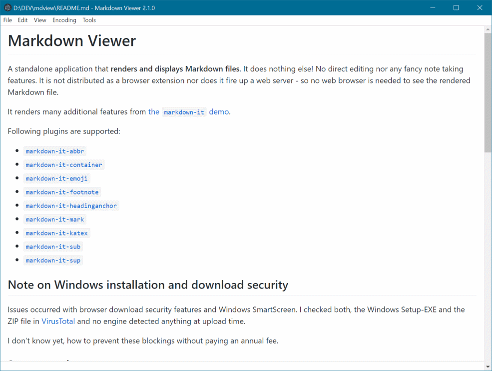

# Markdown Viewer
<!-- markdownlint-disable-next-line MD033-->
[](./doc/screenshots.md "display the full sized screenshot(s)")

## Summary

A standalone application that **renders and displays Markdown files** (no editing nor any fancy note taking feature) on Windows 10 (installer or zip) and Debian/Ubuntu Linux (AppImage) clients.

This application is based on the [Electron](https://www.electronjs.org/languages/en-US) framework: a free and open-source software framework used to develop and build cross-platform (Mac, Windows, and Linux) desktop apps with JavaScript, HTML, and CSS.

You may encounter some *well-known issues* (see "Known issues" below), while installing or running the *Electron based applications*.

## Markdown

The application renders **standard markdown** (see [Basic Syntax](https://www.markdownguide.org/basic-syntax/)) formated files and supports **additional features** as provided by the following [markdown-it](https://github.com/markdown-it/markdown-it) plugins.

- [`markdown-it-abbr`](https://github.com/markdown-it/markdown-it-abbr)
- [`markdown-it-container`](https://github.com/markdown-it/markdown-it-container)
- [`markdown-it-emoji`](https://github.com/markdown-it/markdown-it-emoji)
- [`markdown-it-footnote`](https://github.com/markdown-it/markdown-it-footnote)
- [`markdown-it-headinganchor`](https://github.com/adam-p/markdown-it-headinganchor)
- [`markdown-it-mark`](https://github.com/markdown-it/markdown-it-mark)
- [`markdown-it-katex`](https://github.com/waylonflinn/markdown-it-katex)
- [`markdown-it-sub`](https://github.com/markdown-it/markdown-it-sub)
- [`markdown-it-sup`](https://github.com/markdown-it/markdown-it-sup)

## Development

The tool is currently developed and tested under Windows 10 (X64).

### Requirements

An actual [Node.js](https://nodejs.org/) and NPM version (usually installed together with Node.js) are required to setup a development environment.

You may also prefer to use **NVM** on windows and on Linux. See:

- [Install nvm, node.js and npm on Windows](https://docs.microsoft.com/en-us/windows/dev-environment/javascript/nodejs-on-windows)
- [Install nvm, node.js and npm on Linux, unix, macOS, and windows WSL](https://github.com/nvm-sh/nvm#about)

### Source code and project setup

Clone the github repository and install the project dependencies:

```shell
git clone https://github.com/khatastroffik/mdview.git
cd mdview
npm install
```

To **start** an instance of the **application**, type `npm start`.

To **generate** the different application **packages/binaries**, type `npm run dist`. This will generate the artifacts (installer, AppImage or compressed archive) depending on your Operating System. MacOS binaries cannot be generated at the present time due to builder settings/properties related issues. Pull requests are welcome!

To **re-generate** the **icons** under Windows, use the script `generate-icons.cmd` provided in the `icon`  folder. This script rely on [ImageMagick](https://www.imagemagick.org), which thus needs to be installed.

### Debugging

The main process can be debugged with [Visual Studio Code](https://code.visualstudio.com/). A `launch.json` is provided in the `.vscode` folder within this repository.

The renderer process (implemented in `index.html` and `index.js`) must be debugged with help of the Electron development tools by calling in the main menu &#128514; "Tools" 🡒 "Developer tools" or by pressing the \[F10\] key.

### Contribution

Please see the [Contributing](./CONTRIBUTING.md) guideline.

## Known issues

The following "potential" issues are well-known:

### Windows installation and download security

An issue may occur due to some *browser download security* features or *Windows SmartScreen* technology. Anyhow, the provided package should be safe, though prefer to check them using an antivirus scanner like [VirusTotal](https://www.virustotal.com).

### Startup speed

The application may have a delay at startup. This delay may be caused by Windows Defender.This may be due to your virus scanner e.g. Windows Defender.

### Build error *ERR_ELECTRON_BUILDER_CANNOT_EXECUTE* (development)

You may encounter some issue when trying to build the electron distribution (binaries) i.e. the build may (partially) fail.

A possible fix is described here [not able to build installer/uninstaller (ERR_ELECTRON_BUILDER_CANNOT_EXECUTE)](./doc/development-build-installer-issue.md)

## Credits

The original application has been created by [Christian Dreier](https://github.com/c3er): **many thanks for your inspiration!**

This application is based on version 2.0.0 of the above mentioned application. See the repository containing the original code of this application on [GitHub](https://github.com/c3er/mdview).

## Copyright and License

This application is provided under the [**MIT** license](./LICENSE).

A [K11K](./K11K.md) production.

```text
╭━┳━╭━╭━╮╮
┃┈┈┈┣▅╋▅┫
┃┈┃┈╰━╰━━━━━━╮             "K11K"
╰┳╯┈┈┈┈┈┈┈┈┈◢▉◣    A very pragmatic dog
 ┃┈┈┈┈┈┈┈┈┈┈▉▉▉   
 ┃┈┈┈┈┈┈┈┈┈┈◥▉◤
 ┃┈┈┈┈╭━┳━━━━╯
 ┣━━━━━━┫
```
